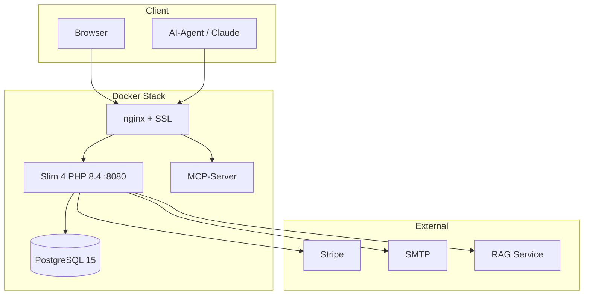

# edocs.cloud

[](https://github.com/bastelix/edocs-cloud/actions/workflows/deploy.yml)
[](https://github.com/bastelix/edocs-cloud/actions/workflows/tests.yml)
[](https://github.com/bastelix/edocs-cloud/actions/workflows/html-validity.yml)

Multi-Tenant-Agentur-CMS mit Quiz-Engine, Wiki, Ticketsystem und MCP-Integration für AI-Agenten.

**Dokumentation:** <https://bastelix.github.io/edocs-cloud/>

---

## Architektur



### Kernkonzepte

- **Namespace** – Zentrale Mandanten-Einheit mit eigenen Inhalten, Design und Domains
- **Pages** – Block-basiertes Content-Modell (Hero, Text, Feature-List, etc.)
- **Custom Domains** – Beliebig viele Domains pro Namespace, automatisches SSL
- **MCP-Server** – 60+ Tools für AI-Agenten über OAuth 2.0

---

## Tech-Stack

| Komponente | Technologie |
|---|---|
| Backend | PHP 8.4, Slim 4, Twig 3 |
| Frontend | UIkit 3, Vanilla JS |
| Datenbank | PostgreSQL 15 |
| Billing | Stripe |
| E-Mail | Symfony Mailer (Brevo, Sendgrid, Mailchimp) |
| AI | MCP-Server, OpenAI-kompatible RAG-API |
| Container | Docker, nginx, ACME/Let's Encrypt |
| CI/CD | GitHub Actions |
| Docs | MkDocs Material |
| Tests | PHPUnit, PHPStan (Level 4), PHPCS |

---

## Module

| Modul | Beschreibung |
|---|---|
| **Quiz/Events** | 6 Fragetypen, Kataloge, Teams, KI-Teamnamen, Echtzeit-Ergebnisse |
| **Wiki** | Markdown-Artikel mit Versionierung und Status-Workflow |
| **Ticketsystem** | Bug- und Aufgabenverwaltung mit Status-Transitions |
| **News** | Blog-Artikel mit RSS/Atom-Feeds |
| **Menü-System** | Hierarchische Menüs mit Slot-Zuweisungen |
| **Footer-Builder** | Block-basierter Footer mit 6 Block-Typen |
| **Design-System** | Tokens, Presets, Custom CSS, Live-Mapping |

---

## Schnellstart

### Docker (empfohlen)

```bash
cp sample.env .env
# .env anpassen (DOMAIN, Postgres-Credentials)
docker compose up --build -d
```

Das Entrypoint-Skript installiert Abhängigkeiten, legt die DB an und führt Migrationen aus.

### Ohne Docker

```bash
# PHP 8.2+ und PostgreSQL erforderlich
composer install

# Umgebungsvariablen setzen
export POSTGRES_DSN="pgsql:host=localhost;dbname=quiz"
export POSTGRES_USER=quiz
export POSTGRES_PASSWORD=secret
export POSTGRES_DB=quiz

# Schema + Migrationen
psql -h localhost -U "$POSTGRES_USER" -d "$POSTGRES_DB" -f docs/schema.sql
php scripts/run_migrations.php
php scripts/import_to_pgsql.php

# Server starten
php -S localhost:8080 -t public public/router.php
```

### Seed-Daten

```bash
php scripts/seed_roles.php
```

Erstellt Testbenutzer pro Rolle: `admin`, `catalog-editor`, `event-manager`, `analyst`, `team-manager`.

---

## Health-Check

```
GET /healthz → HTTP 200 {"status":"ok","version":"1.4.1","db":"ok"}
```

---

## Projektstruktur

```
├── config/              # Settings, php.ini, Design-Tokens
├── docs/                # MkDocs-Dokumentation
├── migrations/          # 143+ SQL-Migrationen
├── public/              # Webroot (CSS, JS, UIkit, Uploads)
├── scripts/             # CLI-Skripte
├── src/
│   ├── Controller/      # 59 Root + 30 Admin + 13 Marketing + 7 API v1
│   ├── Domain/          # Entities (Page, Ticket, Menu, Wiki, etc.)
│   ├── Repository/      # 9 Repositories
│   ├── Service/         # 40+ Services
│   │   └── Mcp/         # 9 MCP-Tool-Klassen + Registry
│   ├── Application/
│   │   └── Middleware/  # 16 Middleware-Klassen
│   └── Routes/          # admin.php, api_v1.php, mcp.php
├── templates/           # Twig-Vorlagen
├── tests/               # PHPUnit, Python, Node.js
├── docker-compose.yml
├── Dockerfile
└── mkdocs.yml
```

---

## API

### REST API v1

Base-URL: `/api/v1` · Auth: Bearer-Token · Content-Type: `application/json`

Scopes: `cms:read`, `cms:write`, `seo:write`, `menu:read`, `menu:write`, `news:read`, `news:write`

Vollständige Referenz: [API-Dokumentation](https://bastelix.github.io/edocs-cloud/api-v1-reference/)

### MCP-Server

Endpoint: `/mcp` · Auth: OAuth 2.0 · 60+ Tools

Tool-Klassen: Pages, Menus, News, Footer, Quiz, Design, Wiki, Tickets, Backup

Vollständige Referenz: [MCP-Tool-Dokumentation](https://bastelix.github.io/edocs-cloud/mcp-reference/)

---

## Testing

```bash
# PHP
vendor/bin/phpunit

# Alle Tests (PHP + Python + Node.js)
composer test
```

Benötigt eine laufende PostgreSQL-Instanz (`.env.test`). Für Docker: `docker-compose.test.yml`.

---

## Deployment

Automatisch via GitHub Actions bei Push auf `main`:

1. SSH auf Produktionsserver
2. Git Pull + Docker Build
3. Migrationen ausführen
4. Container neu starten

Semantic Versioning und Changelog werden automatisch generiert.

---

## Dokumentation

Die ausführliche Dokumentation wird mit MkDocs Material erstellt und auf GitHub Pages gehostet.

```bash
# Lokal bauen
pip install mkdocs-material mkdocs-glightbox
mkdocs serve
```

Live unter: <https://bastelix.github.io/edocs-cloud/>

---

## Lizenz

Proprietäre Lizenz. Alle Rechte liegen bei René Buske.
