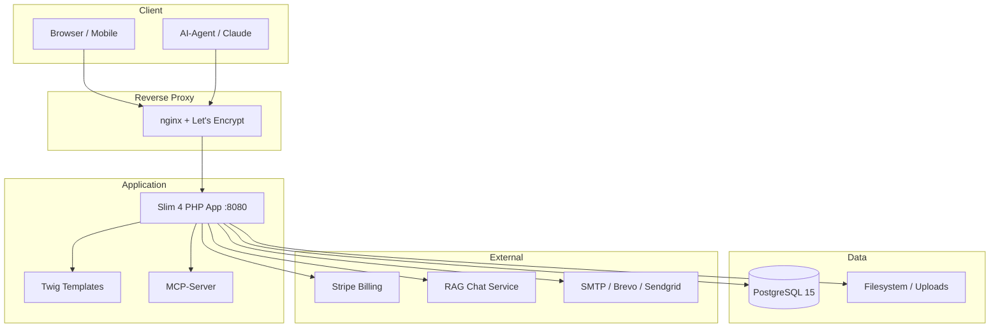
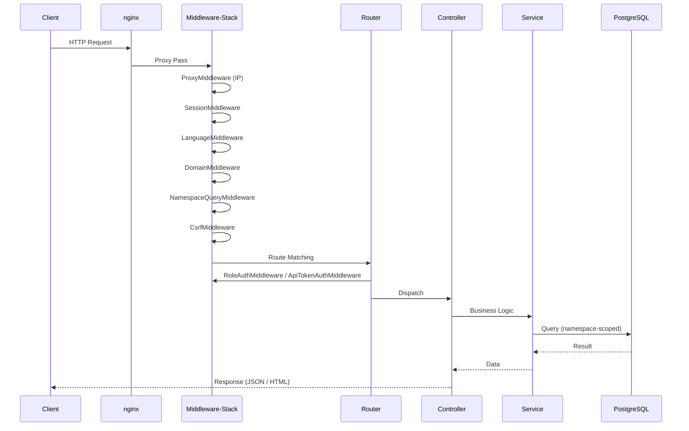

# Architektur-Überblick

edocs.cloud ist ein Multi-Tenant-Agentur-CMS auf Basis von Slim 4 (PHP) und Twig. Die Anwendung kombiniert ein Quiz-/Event-System mit einem vollständigen CMS inkl. Wiki, Ticketsystem, News und Design-Token-System.

---

## Systemarchitektur



---

## Kernkonzepte

### Namespace-Modell

Ein **Namespace** ist die zentrale Organisationseinheit. Jeder Namespace repräsentiert einen Mandanten/eine Marke mit eigenem Design, eigenen Inhalten und eigener Domain-Zuordnung.

| Eigenschaft | Beschreibung |
|---|---|
| Bezeichner | Kleinbuchstaben, Ziffern, Bindestriche (`^[a-z0-9][a-z0-9-]*$`) |
| Max. Länge | 100 Zeichen |
| Isolation | Eigene Pages, Menus, Footer, Events, Design-Tokens, Wiki-Artikel, Tickets |
| Domain-Mapping | Beliebig viele Custom Domains pro Namespace (kein Subdomain-Routing) |

### Page-Modell

Seiten basieren auf einem Block-Content-Modell. Jede Page gehört zu genau einem Namespace und hat folgende Attribute:

- **slug** – URL-Pfad (eindeutig pro Namespace)
- **blocks** – Array von Block-Objekten (Hero, Text, Feature-List, Testimonial, etc.)
- **status** – `draft` oder `published`
- **type** – Seitentyp (page, landing, legal, etc.)
- **language** – Sprachcode
- **parentId** – Elternseite für Baumstruktur

### Custom Domains

Domains werden in der `domains`-Tabelle verwaltet und über die `DomainMiddleware` aufgelöst. SSL-Zertifikate werden automatisch via ACME/Let's Encrypt provisioniert.

---

## Request-Lifecycle



### Middleware-Stack

| Middleware | Aufgabe |
|---|---|
| `ProxyMiddleware` | X-Forwarded-For Header auswerten |
| `SessionMiddleware` | PHP-Session verwalten |
| `LanguageMiddleware` | Locale aus Request/Session ermitteln |
| `DomainMiddleware` | Domain → Namespace auflösen |
| `NamespaceQueryMiddleware` | `?namespace=` Parameter auswerten |
| `MarketingNamespaceMiddleware` | Namespace für Marketing-Routes auflösen |
| `CsrfMiddleware` | CSRF-Token bei POST/PUT/DELETE prüfen |
| `RoleAuthMiddleware` | Rollenbasierte Zugriffskontrolle (Admin-Bereich) |
| `ApiTokenAuthMiddleware` | Bearer-Token-Authentifizierung (API v1) |
| `OAuthTokenAuthMiddleware` | OAuth-Token-Validierung (MCP) |
| `RateLimitMiddleware` | Rate-Limiting für öffentliche Endpoints |
| `HeadRequestMiddleware` | HEAD-Requests als GET ohne Body behandeln |

---

## Verzeichnisstruktur

```
edocs-cloud/
├── config/                 # Einstellungen (settings.php, php.ini, Design-Tokens)
├── data/kataloge/          # Fragenkataloge (JSON)
├── docs/                   # MkDocs-Dokumentation
├── migrations/             # SQL-Migrationsdateien (143+)
├── nginx-reloader/         # nginx-Reload-Helfer (Docker)
├── public/                 # Webroot (index.php, CSS, JS, UIkit)
│   ├── css/                # Stylesheets (marketing.css, etc.)
│   ├── js/                 # JavaScript-Module
│   └── uploads/            # Nutzer-Uploads
├── resources/blocklists/   # Moderations-Blocklisten (CSV)
├── scripts/                # CLI-Skripte (Migrationen, Import, Seed)
├── src/
│   ├── Application/
│   │   └── Middleware/     # 16 Middleware-Klassen
│   ├── Controller/
│   │   ├── Admin/          # 30 Admin-Controller
│   │   ├── Api/            # MCP + OAuth Controller
│   │   │   └── V1/        # 7 API-v1-Controller
│   │   └── Marketing/      # 13 Marketing-Controller
│   ├── Domain/             # Entities (Page, Ticket, CmsMenu, etc.)
│   ├── Infrastructure/     # Migration-Runtime, SQLite-Schema
│   ├── Repository/         # 9 Repository-Klassen
│   ├── Routes/             # Route-Dateien (admin.php, api_v1.php, mcp.php)
│   ├── Service/
│   │   ├── Mcp/            # 9 MCP-Tool-Klassen + Registry
│   │   ├── Marketing/      # AI-Generierung, Wiki-Publisher
│   │   └── MailProvider/   # Brevo, Sendgrid, Mailchimp
│   └── routes.php          # Haupt-Route-Datei
├── templates/              # Twig-Vorlagen
├── tests/                  # PHPUnit, Python, Node.js Tests
├── docker-compose.yml      # Production Stack
├── Dockerfile              # PHP 8.4 Alpine Image
└── mkdocs.yml              # Dokumentations-Konfiguration
```

---

## Tech-Stack

| Komponente | Technologie |
|---|---|
| Backend | PHP 8.4, Slim 4 Framework |
| Templates | Twig 3 |
| Frontend | UIkit 3, Vanilla JS |
| Datenbank | PostgreSQL 15 |
| Billing | Stripe (Checkout, Subscriptions, Webhooks) |
| E-Mail | Symfony Mailer (Brevo, Sendgrid, Mailchimp) |
| AI/Chat | OpenAI-kompatible RAG-API |
| MCP | Model Context Protocol Server (OAuth 2.0) |
| QR-Codes | chillerlan/php-qrcode |
| PDF | FPDF + FPDI |
| Bildbearbeitung | Intervention Image 3, ImageMagick |
| Container | Docker, docker-compose, nginx, ACME |
| CI/CD | GitHub Actions (Tests, Deploy, Changelog) |
| Docs | MkDocs Material |
| Code-Qualität | PHPUnit, PHPStan (Level 4), PHP_CodeSniffer |
