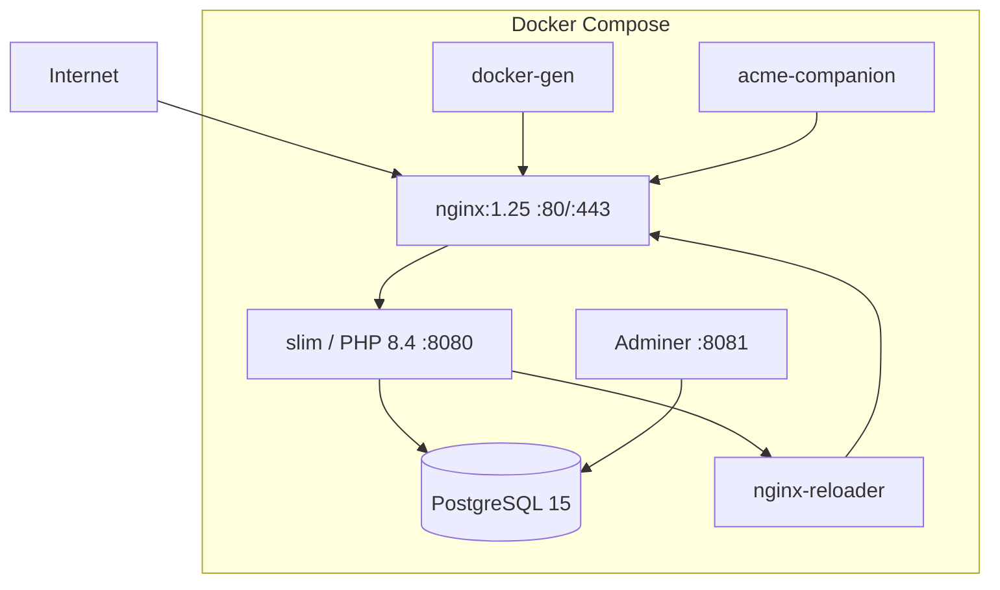

# Deployment & Infrastruktur

edocs.cloud wird als Docker-Stack betrieben. Diese Seite beschreibt Setup, Konfiguration und Betrieb.

---

## Docker-Stack



### Services

| Service | Image | Beschreibung |
|---|---|---|
| `nginx` | nginx:1.25-alpine | Reverse Proxy mit SSL-Terminierung |
| `docker-gen` | Custom | Template-Generator für nginx-Konfiguration |
| `acme-companion` | nginxproxy/acme-companion | Automatische Let's Encrypt Zertifikate |
| `slim` | Custom (PHP 8.4 Alpine) | Haupt-Applikation |
| `postgres` | postgres:15 | Datenbank |
| `adminer` | adminer | DB-Admin-UI unter `adminer.${DOMAIN}` |
| `nginx-reloader` | Custom | nginx-Reload per Webhook |

### Volumes

| Volume | Beschreibung |
|---|---|
| `certs` | SSL-Zertifikate |
| `htmldata` | Statische Dateien |
| `confd` | nginx-Konfiguration |
| `acme` | ACME-Daten |
| `dhparam` | DH-Parameter |
| `pgdata` | PostgreSQL-Daten |

---

## Schnellstart

```bash
# 1. Konfiguration
cp sample.env .env
# .env anpassen (DOMAIN, Postgres-Credentials, etc.)

# 2. Stack starten
docker compose up --build -d

# 3. Status prüfen
docker compose ps
curl -f http://localhost:8080/healthz
```

Das Entrypoint-Skript führt automatisch aus:

1. Composer-Abhängigkeiten installieren (falls `vendor/` fehlt)
2. Datenbank-Schema anlegen (`docs/schema.sql`)
3. JSON-Daten importieren
4. Migrationen ausführen

---

## Umgebungsvariablen

### Pflicht

| Variable | Beschreibung |
|---|---|
| `DOMAIN` | Basis-Domain |
| `POSTGRES_DSN` | DB-Verbindung (z.B. `pgsql:host=postgres;dbname=quiz`) |
| `POSTGRES_USER` | DB-Benutzer |
| `POSTGRES_PASSWORD` | DB-Passwort |
| `POSTGRES_DB` | Datenbankname |

### Netzwerk & Proxy

| Variable | Default | Beschreibung |
|---|---|---|
| `NETWORK` | `webproxy` | Docker-Netzwerkname |
| `NETWORK_EXTERNAL` | `false` | Bestehendes Netzwerk nutzen |
| `NGINX_RELOAD` | `0` | nginx per Docker-CLI reloaden |
| `NGINX_RELOAD_TOKEN` | – | Token für Reloader-Webhook |
| `NGINX_RELOADER_URL` | `http://nginx-reloader:8080/reload` | Reloader-URL |
| `CLIENT_MAX_BODY_SIZE` | `50m` | Max. Upload-Größe |

### SSL/TLS

| Variable | Beschreibung |
|---|---|
| `LETSENCRYPT_EMAIL` | E-Mail für Let's Encrypt |
| `ENABLE_WILDCARD_SSL` | Wildcard-Zertifikate via DNS-01 |
| `ACME_WILDCARD_PROVIDER` | DNS-Plugin (`dns_cf`, `dns_hetzner`) |
| `ACME_DEFAULT_CA` | ACME CA URL |
| `SSL_CERT_WAIT_SECONDS` | Wartezeit bei SSL-Provisionierung |

### Stripe/Billing

| Variable | Beschreibung |
|---|---|
| `STRIPE_SECRET_KEY` | Stripe Secret Key |
| `STRIPE_PUBLISHABLE_KEY` | Stripe Publishable Key |
| `STRIPE_WEBHOOK_SECRET` | Webhook-Verifizierung |
| `STRIPE_PRICE_STARTER` | Preis-ID Starter-Plan |
| `STRIPE_PRICE_STANDARD` | Preis-ID Standard-Plan |
| `STRIPE_PRICE_PROFESSIONAL` | Preis-ID Professional-Plan |
| `STRIPE_TRIAL_DAYS` | Testphase in Tagen (Standard: 7) |
| `STRIPE_SANDBOX` | Sandbox-Modus (`0`/`1`) |

### E-Mail

| Variable | Beschreibung |
|---|---|
| `MAILER_DSN` | Symfony Mailer DSN |
| `SMTP_HOST` | SMTP-Server |
| `SMTP_PORT` | SMTP-Port (Standard: 587) |
| `SMTP_USER` / `SMTP_PASS` | SMTP-Credentials |
| `SMTP_FROM` / `SMTP_FROM_NAME` | Absender |
| `MAIL_PROVIDER_SECRET` | Verschlüsselungs-Secret für Provider-Config |

### AI/RAG

| Variable | Beschreibung |
|---|---|
| `RAG_CHAT_SERVICE_URL` | Chat-Service-Endpoint |
| `RAG_CHAT_SERVICE_TOKEN` | API-Token |
| `RAG_CHAT_SERVICE_MODEL` | Modellname |
| `RAG_CHAT_SERVICE_TIMEOUT` | Timeout in Sekunden (Standard: 60) |

### Feature-Flags

| Variable | Default | Beschreibung |
|---|---|---|
| `FEATURE_WIKI_ENABLED` | `true` | Wiki-Modul aktiviert |
| `FEATURE_MARKETING_NAV_TREE_ENABLED` | `true` | Navigationsbaum aktiviert |
| `FEATURE_MARKETING_MENU_LEGACY_FALLBACK` | `true` | Legacy-Menü-Fallback |

---

## Domain-Mapping

Custom Domains werden über die Admin-Oberfläche (`/admin/domains`) verwaltet.

### Ablauf

1. Domain in Admin anlegen (`POST /admin/domains`)
2. DNS-Eintrag setzen (A-Record oder CNAME auf Server)
3. SSL-Zertifikat provisionieren (`POST /admin/domains/{id}/ssl`)
4. nginx-Konfiguration wird automatisch via docker-gen aktualisiert

### Automatischer SSL-Provisioning

Der ACME-Companion überwacht neue Container/Domains und stellt Zertifikate automatisch aus. Wildcard-Zertifikate werden über DNS-01 Challenge unterstützt.

---

## Datenbank-Migrationen

```bash
# Lokal
php scripts/run_migrations.php

# Im Docker-Container
docker compose exec slim php scripts/run_migrations.php
```

Migrationen liegen in `migrations/` (143+ Dateien) und werden chronologisch ausgeführt. Der Status wird in der `migrations`-Tabelle protokolliert.

Für lokale Tests: `RUN_MIGRATIONS_ON_REQUEST=true` aktiviert Migrationen bei jedem Request.

---

## Health-Check

```
GET /healthz
```

Gibt HTTP 200 mit JSON-Payload zurück:

```json
{
  "status": "ok",
  "version": "1.4.1",
  "db": "ok"
}
```

Der Docker Healthcheck nutzt `curl -f http://localhost:8080/healthz`.

---

## CI/CD

### GitHub Actions Workflows

| Workflow | Trigger | Beschreibung |
|---|---|---|
| `tests.yml` | PR, Push main | PHPUnit, PHPStan, PHPCS, Python, Node Tests |
| `deploy.yml` | Push main | SSH-Deploy, Docker-Build, Migrationen |
| `bump-version.yml` | Push main | Automatisches Semantic Versioning |
| `update-changelog.yml` | Push main | Changelog via git-cliff |
| `pages.yml` | Änderungen in docs/ | MkDocs-Deployment auf GitHub Pages |
| `composer-install.yml` | Manuell | Composer Lock aktualisieren |
| `html-validity.yml` | PR, Push main | HTML-Validierungstests |

---

## Tenant-Erstellung

Neue Tenants werden über das Skript `scripts/create_tenant.sh` erstellt:

1. PostgreSQL-Schema anlegen
2. nginx-Konfiguration generieren
3. SSL-Zertifikat anfordern
4. nginx reloaden

```bash
# Im Container
docker compose exec slim bash scripts/create_tenant.sh mein-tenant
```

---

## Monitoring

| Metrik | Zugang |
|---|---|
| System-Metriken | `/admin/system/metrics` |
| Audit-Logs | `/admin/logs` |
| Container-Metriken | `CONTAINER_METRICS_LOGGING=true` |
| Admin-Request-Logging | `ADMIN_REQUEST_LOGGING=true` |
