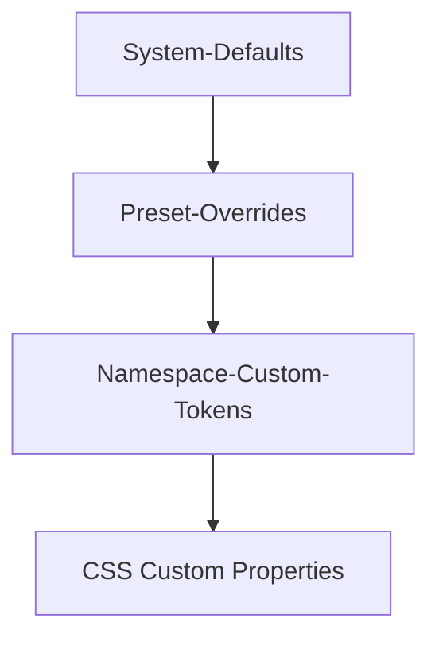

# Design-System

Das Design-Token-System ermöglicht die individuelle visuelle Gestaltung jedes Namespace. Tokens steuern Farben, Layout, Typografie und Komponentenstile über CSS Custom Properties.

---

## Token-Gruppen

| Gruppe | Tokens | Beispielwerte |
|---|---|---|
| `brand` | `primary`, `accent`, `secondary` | `#1e87f0`, `#f97316` |
| `layout` | `profile` | `narrow`, `standard`, `wide` |
| `typography` | `preset` | `modern`, `classic`, `tech` |
| `components` | `cardStyle`, `buttonStyle` | `rounded`/`square`/`pill`, `filled`/`outline`/`ghost` |

---

## Vererbungskette

Tokens werden in einer dreistufigen Kaskade aufgelöst:



1. **System-Defaults** – Fest definierte Standardwerte
2. **Preset-Overrides** – Voreingestellte Paletten/Styles
3. **Namespace-Custom** – Individuelle Anpassungen pro Namespace

---

## Token-Schema

### Brand

| Token | Typ | Beschreibung |
|---|---|---|
| `brand.primary` | CSS-Color | Primärfarbe |
| `brand.accent` | CSS-Color | Akzentfarbe |
| `brand.secondary` | CSS-Color | Sekundärfarbe |

### Layout

| Token | Werte | Beschreibung |
|---|---|---|
| `layout.profile` | `narrow`, `standard`, `wide` | Seitenbreite |

### Typografie

| Token | Werte | Beschreibung |
|---|---|---|
| `typography.preset` | `modern`, `classic`, `tech` | Schriftprofil |

CSS-Mapping:

- `modern` → System-Sans-Serif-Stack
- `classic` → Serif-Fonts
- `tech` → Monospace-nahe Fonts

### Komponentenstile

| Token | Werte | Beschreibung |
|---|---|---|
| `components.cardStyle` | `rounded`, `square`, `pill` | Karten-Rahmen |
| `components.buttonStyle` | `filled`, `outline`, `ghost` | Button-Stil |

CSS-Mapping über `data-*`-Attribute:

- `data-card-style` → `--marketing-card-radius`, `--marketing-shadow-card`
- `data-button-style` → Button-Surface-Variables
- `data-typography-preset` → `--marketing-font-stack`, `--marketing-heading-weight`

---

## Marketing-Tokens

Marketing-Seiten verwenden ein erweitertes Token-Set mit Licht-/Dunkel-Modus:

| Token | Beschreibung |
|---|---|
| `--marketing-primary` | Primärfarbe (aus `brand.primary`) |
| `--marketing-accent` | Akzentfarbe (aus `brand.accent`) |
| `--marketing-link` | Link-Farbe |
| `--marketing-surface` | Karten-Hintergrund |
| `--marketing-background` | Seiten-Hintergrund |
| `--marketing-text-on-surface` | Text auf Karten |
| `--marketing-text-on-background` | Text auf Seitenhintergrund |
| `--marketing-text-muted-on-surface` | Muted Text auf Karten |
| `--marketing-text-muted-on-background` | Muted Text auf Hintergrund |

Für Dark-Mode existieren Pendants: `--marketing-text-on-surface-dark`, etc.

Die Tokens werden in `templates/marketing/partials/theme-vars.twig` emittiert und in `public/css/marketing.css` konsumiert.

---

## Presets

Vordefinierte Marketing-Paletten können über die Admin-Oberfläche oder MCP importiert werden. Presets überschreiben:

- Alle `--marketing-*` Variablen
- Licht- und Dunkel-Modus-Werte

Die Preset-Definitionen liegen in `config/marketing-design-tokens.php`.

Die Wahl wird in `appearance.variables.marketingScheme` gespeichert. Preset löschen setzt auf Brand-Tokens zurück.

---

## Custom CSS

Pro Namespace kann Custom CSS hinterlegt werden. Der `CssSanitizer` (`src/Service/CssSanitizer.php`) validiert die Eingabe.

```json
{
  "name": "update_custom_css",
  "arguments": {
    "css": ".hero-section { background: linear-gradient(135deg, var(--marketing-primary), var(--marketing-accent)); }"
  }
}
```

---

## Design-Validierung

Das Tool `validate_page_design` prüft die Konsistenz einer Seite gegen das Token-Schema und gibt Fehler und Warnungen zurück:

- Fehlende erforderliche Tokens
- Ungültige Farbwerte
- Inkonsistente Block-Styles

---

## API-Endpoints

| Method | Pfad | Beschreibung |
|---|---|---|
| `GET` | `/api/v1/namespaces/{ns}/design` | Design-Manifest abrufen |
| `GET` | `/api/v1/namespaces/{ns}/design/tokens` | Tokens abrufen |
| `PUT` | `/api/v1/namespaces/{ns}/design/tokens` | Tokens aktualisieren |
| `POST` | `/api/v1/namespaces/{ns}/design/validate` | Design validieren |

---

## Admin-Oberfläche

| Bereich | Route |
|---|---|
| Design-Editor | `/admin/pages/design` |
| Token-Einstellungen | `/admin/pages/design` (Tokens-Tab) |

---

## MCP-Integration

Alle 10 Design-Tools sind über MCP verfügbar (siehe [MCP-Tool-Referenz](mcp-reference.md#stylesheettools)).
