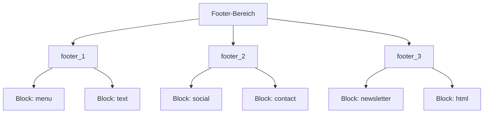

# Footer-Builder

Der Footer-Builder ermöglicht die flexible Gestaltung des Seitenfooters über ein Slot-basiertes Block-System mit verschiedenen Block-Typen.

---

## Architektur



**Beteiligte Dateien:**

- `src/Domain/CmsFooterBlock.php`
- `src/Service/CmsFooterBlockService.php`
- `src/Controller/Admin/MarketingFooterBlockController.php`
- `src/Controller/Admin/NavigationController.php`
- `src/Service/Mcp/FooterTools.php`

---

## Slots

Der Footer ist in drei Spalten (Slots) aufgeteilt:

| Slot | Beschreibung |
|---|---|
| `footer_1` | Linke Spalte |
| `footer_2` | Mittlere Spalte |
| `footer_3` | Rechte Spalte |

Jeder Slot kann beliebig viele Blöcke enthalten, die nach Position sortiert werden.

---

## Block-Typen

| Typ | Content-Schema | Beschreibung |
|---|---|---|
| `menu` | `{ "menuId": int }` | Verknüpfung zu einem CmsMenu |
| `text` | `{ "text": string }` | Freitext (HTML) |
| `social` | `{ "links": [{ "platform": string, "url": string }] }` | Social-Media-Links |
| `contact` | `{ "email": string, "phone": string, "address": string }` | Kontaktdaten |
| `newsletter` | `{ "headline": string, "buttonLabel": string }` | Newsletter-Anmeldeformular |
| `html` | `{ "html": string }` | Beliebiges HTML |

### Block-Felder

| Feld | Typ | Beschreibung |
|---|---|---|
| `id` | int | Auto-Increment ID |
| `namespace` | string | Zugehöriger Namespace |
| `slot` | string | `footer_1`, `footer_2`, `footer_3` |
| `type` | string | Block-Typ (s.o.) |
| `content` | JSON | Typ-abhängiger Inhalt |
| `position` | int | Sortierposition im Slot |
| `locale` | string | Sprachcode |
| `isActive` | bool | Aktiv-Status |
| `updatedAt` | datetime | Letzte Änderung |

---

## Layout-Preferences

Das Footer-Layout wird pro Namespace über die `ProjectSettings` gesteuert:

| Layout | Beschreibung |
|---|---|
| `equal` | Alle drei Spalten gleich breit |
| `brand-left` | Linke Spalte breiter (Brand/Logo) |
| `cta-right` | Rechte Spalte breiter (Call-to-Action) |
| `centered` | Zentriertes Layout |

---

## Reordering

Blöcke innerhalb eines Slots können neu sortiert werden:

```json
{
  "name": "reorder_footer_blocks",
  "arguments": {
    "slot": "footer_1",
    "orderedIds": [3, 1, 2]
  }
}
```

Die `orderedIds`-Liste bestimmt die neue Reihenfolge. Alle Block-IDs des Slots müssen enthalten sein.

---

## Admin-Oberfläche

| Bereich | Route |
|---|---|
| Footer-Übersicht | `/admin/navigation/footer` |
| Blöcke verwalten | `/admin/navigation/footer-blocks` |
| Block erstellen | `POST /admin/navigation/footer-blocks` |
| Block aktualisieren | `PUT /admin/navigation/footer-blocks/{id}` |
| Block löschen | `DELETE /admin/navigation/footer-blocks/{id}` |
| Layout speichern | `POST /admin/navigation/footer-blocks/layout` |
| Sortierung speichern | `POST /admin/navigation/footer-blocks/reorder` |

---

## MCP-Integration

Alle 7 Footer-Tools sind über MCP verfügbar (siehe [MCP-Tool-Referenz](mcp-reference.md#footertools)).
