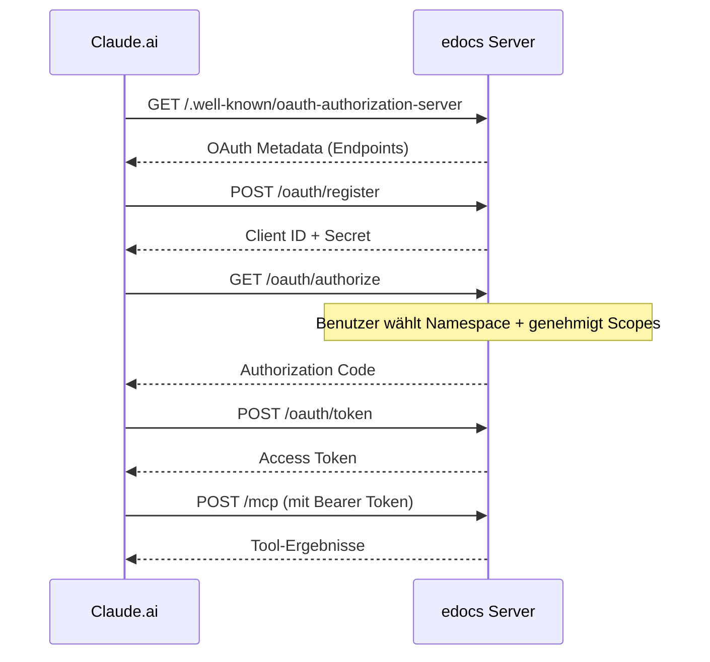

# MCP-Connector einrichten (Claude.ai)

Anleitung zum Verbinden von Claude.ai mit dem edocs.cloud MCP-Server.

---

## Voraussetzungen

- Ein laufender edocs-Server mit HTTPS (z.B. `https://mein-projekt.example.com`)
- Der MCP-Endpunkt ist unter `https://<deine-domain>/mcp` erreichbar
- OAuth 2.0 ist aktiv (automatisch, wenn der Server läuft)

---

## Connector in Claude.ai hinzufügen

1. **Claude.ai** öffnen → Einstellungen → **Connectors** → **Benutzerdefinierten Connector hinzufügen**
2. Felder ausfüllen:

| Feld | Wert | Hinweis |
|---|---|---|
| **Name** | `edocs` (oder beliebig) | Anzeigename in Claude.ai |
| **Remote MCP Server URL** | `https://<deine-domain>/mcp` | z.B. `https://projekt.example.com/mcp` |
| **OAuth Client ID** (optional) | *leer lassen* | Automatische Registrierung via RFC 7591 |
| **OAuth-Client-Geheimnis** (optional) | *leer lassen* | Wird automatisch erzeugt |

3. **Hinzufügen** klicken.

---

## OAuth-Flow



1. Claude ruft `/.well-known/oauth-authorization-server` ab (RFC 8414)
2. Claude registriert sich als OAuth-Client über `POST /oauth/register` (RFC 7591)
3. Du wirst zur Autorisierungsseite (`/oauth/authorize`) weitergeleitet
4. Du wählst den Namespace und genehmigst die Scopes
5. Claude erhält ein Access-Token und kann die MCP-Tools nutzen

---

## Verfügbare Scopes

| Scope | Berechtigung |
|---|---|
| `cms:read` | Seiten lesen (Liste, Baum) |
| `cms:write` | Seiten erstellen und aktualisieren |
| `seo:write` | SEO-Konfiguration schreiben |
| `menu:read` | Menüs und Menüpunkte lesen |
| `menu:write` | Menüs und Menüpunkte erstellen/ändern/löschen |
| `news:read` | News-Artikel lesen |
| `news:write` | News-Artikel erstellen/ändern/löschen |
| `footer:read` | Footer-Blöcke und Layout lesen |
| `footer:write` | Footer-Blöcke erstellen/ändern/löschen |
| `quiz:read` | Events, Kataloge, Ergebnisse und Teams lesen |
| `quiz:write` | Kataloge erstellen/aktualisieren, Ergebnisse einreichen |
| `design:read` | Design-Tokens und Manifest lesen |
| `design:write` | Design-Tokens aktualisieren, Presets importieren |
| `wiki:read` | Wiki-Artikel und -Einstellungen lesen |
| `wiki:write` | Wiki-Artikel erstellen/aktualisieren |
| `ticket:read` | Tickets und Kommentare lesen |
| `ticket:write` | Tickets erstellen/aktualisieren, Kommentare hinzufügen |
| `backup:read` | Namespace-Backup als JSON exportieren |
| `backup:write` | Namespace aus Backup-JSON wiederherstellen |

---

## Verfügbare MCP-Tools (60+)

Nach erfolgreicher Verbindung stehen Claude folgende Tool-Kategorien zur Verfügung:

| Kategorie | Tools | Beschreibung |
|---|---|---|
| **Namespaces** | `list_namespaces` | Alle verfügbaren Namespaces |
| **Pages** | 5 Tools | Seiten-CRUD, Baum, Block-Contract |
| **Menus** | 12 Tools | Menüs, Items, Assignments, Slots |
| **News** | 5 Tools | News-Artikel CRUD |
| **Footer** | 7 Tools | Footer-Blöcke, Layout, Reordering |
| **Quiz/Events** | 8 Tools | Events, Kataloge, Ergebnisse, Teams |
| **Design** | 10 Tools | Tokens, CSS, Presets, Validierung |
| **Wiki** | 7 Tools | Artikel, Versionen, Einstellungen |
| **Tickets** | 8+ Tools | Tickets, Status-Transitions, Kommentare |
| **Backup** | 2 Tools | Namespace-Export/Import |

Vollständige Referenz: [MCP-Tool-Referenz](mcp-reference.md)

### Namespace-Parameter

Alle Tools akzeptieren einen optionalen `namespace`-Parameter. Wird er nicht angegeben, wird der Namespace des OAuth-Tokens verwendet.

```
"Zeige mir alle Seiten im Namespace mein-projekt"
→ Claude ruft list_pages({ namespace: "mein-projekt" }) auf

"Welche Namespaces gibt es?"
→ Claude ruft list_namespaces() auf
```

---

## Fehlerbehebung

| Problem | Lösung |
|---|---|
| Verbindung fehlgeschlagen | Prüfen ob `https://<domain>/mcp` erreichbar ist (HTTPS!) |
| Autorisierung fehlgeschlagen | Server-Logs prüfen, OAuth-Endpunkte testen |
| Tool nicht gefunden | Scope prüfen – fehlt z.B. `cms:read`, sind Page-Tools nicht nutzbar |
| `missing_scope`-Fehler | Connector entfernen und neu hinzufügen, dabei alle Scopes genehmigen |
| `namespace_mismatch` | Token-Namespace stimmt nicht mit angefragtem Namespace überein |

---

## Lokale Entwicklung

Für lokale Entwicklung mit HTTPS (z.B. via Caddy oder mkcert):

| Feld | Wert |
|---|---|
| **Name** | `edocs-dev` |
| **Remote MCP Server URL** | `https://localhost:8443/mcp` |
| **OAuth Client ID** | *leer lassen* |
| **OAuth-Client-Geheimnis** | *leer lassen* |
