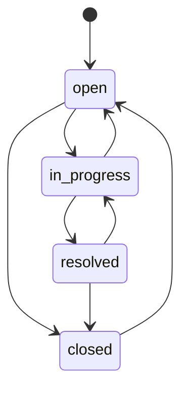

# MCP-Tool-Referenz

edocs.cloud stellt einen vollständigen MCP-Server (Model Context Protocol) bereit, über den AI-Agenten wie Claude alle CMS-Funktionen programmatisch nutzen können.

---

## Verbindung

| Eigenschaft | Wert |
|---|---|
| Endpunkt | `/mcp` (POST, GET, DELETE) |
| Auth | OAuth 2.0 Bearer-Token |
| Discovery | `/.well-known/oauth-authorization-server` |
| Registrierung | `/oauth/register` |
| Token | `/oauth/token` |

Alle Tools akzeptieren einen optionalen `namespace`-Parameter. Fehlt er, wird der Namespace aus dem OAuth-Token abgeleitet.

---

## Tool-Übersicht

| Tool-Klasse | Tools | Beschreibung |
|---|---|---|
| PageTools | 5 | Seiten-CRUD, Baum, Block-Contract |
| MenuTools | 12 | Menüs, Items, Assignments, Slots |
| NewsTools | 5 | News-Artikel CRUD |
| FooterTools | 7 | Footer-Blöcke, Layout, Reordering |
| QuizTools | 8 | Events, Kataloge, Ergebnisse, Teams |
| StylesheetTools | 10 | Design-Tokens, CSS, Presets, Validierung |
| WikiTools | 7 | Wiki-Artikel, Versionen, Einstellungen |
| TicketTools | 8+ | Tickets, Status-Transitions, Kommentare |
| BackupTools | 2 | Namespace-Export/Import |

---

## PageTools

Quelle: `src/Service/Mcp/PageTools.php`

### `list_pages`

Listet alle Seiten eines Namespace auf.

| Parameter | Typ | Pflicht | Beschreibung |
|---|---|---|---|
| `namespace` | string | Nein | Namespace-Slug |

```json
// Beispiel-Aufruf
{ "name": "list_pages", "arguments": { "namespace": "mein-namespace" } }
```

### `get_page_tree`

Gibt die hierarchische Seitenstruktur zurück.

| Parameter | Typ | Pflicht | Beschreibung |
|---|---|---|---|
| `namespace` | string | Nein | Namespace-Slug |

### `get_block_contract`

Gibt das JSON-Schema für alle unterstützten Block-Typen zurück. Keine Parameter.

### `upsert_page`

Erstellt oder aktualisiert eine Seite.

| Parameter | Typ | Pflicht | Beschreibung |
|---|---|---|---|
| `namespace` | string | Nein | Namespace-Slug |
| `slug` | string | Ja | URL-Slug der Seite |
| `blocks` | array | Ja | Block-Array (validiert gegen Block-Contract) |
| `title` | string | Nein | Seitentitel |
| `status` | string | Nein | `draft` oder `published` |
| `meta` | object | Nein | Metadaten (z.B. Layout) |
| `seo` | object | Nein | SEO-Konfiguration |
| `language` | string | Nein | Sprachcode |
| `type` | string | Nein | Seitentyp |
| `base_slug` | string | Nein | Basis-Slug für Sprachvarianten |

```json
{
  "name": "upsert_page",
  "arguments": {
    "namespace": "mein-namespace",
    "slug": "startseite",
    "blocks": [
      { "type": "hero", "data": { "headline": "Willkommen" } }
    ],
    "title": "Startseite",
    "status": "published"
  }
}
```

### `delete_page`

Löscht eine Seite.

| Parameter | Typ | Pflicht | Beschreibung |
|---|---|---|---|
| `namespace` | string | Nein | Namespace-Slug |
| `slug` | string | Ja | URL-Slug der Seite |

---

## MenuTools

Quelle: `src/Service/Mcp/MenuTools.php`

### `list_menus`

Listet alle Menüs eines Namespace.

### `create_menu`

| Parameter | Typ | Pflicht | Beschreibung |
|---|---|---|---|
| `namespace` | string | Nein | Namespace-Slug |
| `label` | string | Ja | Anzeigename |
| `locale` | string | Nein | Sprachcode |
| `isActive` | bool | Nein | Aktiv-Status |

### `update_menu`

| Parameter | Typ | Pflicht | Beschreibung |
|---|---|---|---|
| `namespace` | string | Nein | Namespace-Slug |
| `menuId` | int | Ja | Menü-ID |
| `label` | string | Ja | Anzeigename |
| `locale` | string | Nein | Sprachcode |
| `isActive` | bool | Nein | Aktiv-Status |

### `delete_menu`

| Parameter | Typ | Pflicht | Beschreibung |
|---|---|---|---|
| `namespace` | string | Nein | Namespace-Slug |
| `menuId` | int | Ja | Menü-ID |

### `list_menu_items`

Gibt Items als Baumstruktur zurück.

| Parameter | Typ | Pflicht | Beschreibung |
|---|---|---|---|
| `namespace` | string | Nein | Namespace-Slug |
| `menuId` | int | Ja | Menü-ID |
| `locale` | string | Nein | Sprachfilter |

### `create_menu_item`

| Parameter | Typ | Pflicht | Beschreibung |
|---|---|---|---|
| `namespace` | string | Nein | Namespace-Slug |
| `menuId` | int | Ja | Menü-ID |
| `label` | string | Ja | Anzeigename |
| `href` | string | Ja | Ziel-URL |
| `icon` | string | Nein | Icon-Bezeichner |
| `parentId` | int | Nein | Eltern-ID (für Verschachtelung) |
| `position` | int | Nein | Sortierposition |
| `locale` | string | Nein | Sprachcode |
| `isExternal` | bool | Nein | Externer Link |
| `isActive` | bool | Nein | Aktiv-Status |

### `update_menu_item`

| Parameter | Typ | Pflicht | Beschreibung |
|---|---|---|---|
| `itemId` | int | Ja | Item-ID |
| `label` | string | Ja | Anzeigename |
| `href` | string | Ja | Ziel-URL |
| `icon` | string | Nein | Icon-Bezeichner |
| `parentId` | int | Nein | Eltern-ID |
| `position` | int | Nein | Sortierposition |
| `locale` | string | Nein | Sprachcode |
| `isExternal` | bool | Nein | Externer Link |
| `isActive` | bool | Nein | Aktiv-Status |

### `delete_menu_item`

| Parameter | Typ | Pflicht | Beschreibung |
|---|---|---|---|
| `itemId` | int | Ja | Item-ID |

### `list_menu_assignments`

Listet Menü-Slot-Zuweisungen.

| Parameter | Typ | Pflicht | Beschreibung |
|---|---|---|---|
| `namespace` | string | Nein | Namespace-Slug |
| `slot` | string | Nein | Filter: `main`, `footer_1`, `footer_2`, `footer_3` |
| `locale` | string | Nein | Sprachfilter |
| `menuId` | int | Nein | Menü-Filter |
| `pageId` | int | Nein | Seiten-Filter |

### `create_menu_assignment`

| Parameter | Typ | Pflicht | Beschreibung |
|---|---|---|---|
| `namespace` | string | Nein | Namespace-Slug |
| `menuId` | int | Ja | Menü-ID |
| `slot` | string | Ja | Slot: `main`, `footer_1`, `footer_2`, `footer_3` |
| `locale` | string | Nein | Sprachcode |
| `pageId` | int | Nein | Seiten-spezifisch |
| `isActive` | bool | Nein | Aktiv-Status |

### `update_menu_assignment`

| Parameter | Typ | Pflicht | Beschreibung |
|---|---|---|---|
| `namespace` | string | Nein | Namespace-Slug |
| `assignmentId` | int | Ja | Assignment-ID |
| `menuId` | int | Ja | Menü-ID |
| `slot` | string | Ja | Slot |
| `locale` | string | Nein | Sprachcode |
| `pageId` | int | Nein | Seiten-spezifisch |
| `isActive` | bool | Nein | Aktiv-Status |

### `delete_menu_assignment`

| Parameter | Typ | Pflicht | Beschreibung |
|---|---|---|---|
| `namespace` | string | Nein | Namespace-Slug |
| `assignmentId` | int | Ja | Assignment-ID |

---

## NewsTools

Quelle: `src/Service/Mcp/NewsTools.php`

### `list_news`

| Parameter | Typ | Pflicht | Beschreibung |
|---|---|---|---|
| `namespace` | string | Nein | Namespace-Slug |

### `get_news`

| Parameter | Typ | Pflicht | Beschreibung |
|---|---|---|---|
| `namespace` | string | Nein | Namespace-Slug |
| `id` | int | Ja | News-ID |

### `create_news`

| Parameter | Typ | Pflicht | Beschreibung |
|---|---|---|---|
| `namespace` | string | Nein | Namespace-Slug |
| `pageId` | int | Ja | Zugehörige Seite |
| `slug` | string | Ja | URL-Slug |
| `title` | string | Ja | Titel |
| `content` | string | Ja | HTML-Inhalt |
| `excerpt` | string | Nein | Anreißertext |
| `imageUrl` | string | Nein | Bild-URL |
| `isPublished` | bool | Nein | Veröffentlicht |
| `publishedAt` | string | Nein | ISO 8601 Datum |

```json
{
  "name": "create_news",
  "arguments": {
    "namespace": "mein-namespace",
    "pageId": 42,
    "slug": "neue-funktion",
    "title": "Neue Funktion verfügbar",
    "content": "<p>Wir haben eine neue Funktion eingeführt.</p>",
    "isPublished": true
  }
}
```

### `update_news`

| Parameter | Typ | Pflicht | Beschreibung |
|---|---|---|---|
| `namespace` | string | Nein | Namespace-Slug |
| `id` | int | Ja | News-ID |
| `pageId` | int | Nein | Zugehörige Seite |
| `slug` | string | Nein | URL-Slug |
| `title` | string | Nein | Titel |
| `content` | string | Nein | HTML-Inhalt |
| `excerpt` | string | Nein | Anreißertext |
| `imageUrl` | string | Nein | Bild-URL |
| `isPublished` | bool | Nein | Veröffentlicht |
| `publishedAt` | string | Nein | ISO 8601 Datum |

### `delete_news`

| Parameter | Typ | Pflicht | Beschreibung |
|---|---|---|---|
| `namespace` | string | Nein | Namespace-Slug |
| `id` | int | Ja | News-ID |

---

## FooterTools

Quelle: `src/Service/Mcp/FooterTools.php`

### `list_footer_blocks`

| Parameter | Typ | Pflicht | Beschreibung |
|---|---|---|---|
| `namespace` | string | Nein | Namespace-Slug |
| `slot` | string | Nein | `footer_1`, `footer_2`, `footer_3` |
| `locale` | string | Nein | Sprachfilter |
| `includeInactive` | bool | Nein | Auch inaktive Blöcke |

### `create_footer_block`

| Parameter | Typ | Pflicht | Beschreibung |
|---|---|---|---|
| `namespace` | string | Nein | Namespace-Slug |
| `slot` | string | Ja | `footer_1`, `footer_2`, `footer_3` |
| `type` | string | Ja | `menu`, `text`, `social`, `contact`, `newsletter`, `html` |
| `content` | object | Ja | Typ-abhängiger Inhalt (s.u.) |
| `position` | int | Nein | Sortierposition |
| `locale` | string | Nein | Sprachcode |
| `isActive` | bool | Nein | Aktiv-Status |

**Content-Struktur nach Typ:**

| Typ | Content-Felder |
|---|---|
| `menu` | `{ "menuId": 1 }` |
| `text` | `{ "text": "Freitext HTML" }` |
| `social` | `{ "links": [{ "platform": "twitter", "url": "..." }] }` |
| `contact` | `{ "email": "...", "phone": "...", "address": "..." }` |
| `newsletter` | `{ "headline": "...", "buttonLabel": "..." }` |
| `html` | `{ "html": "<div>Custom HTML</div>" }` |

### `update_footer_block`

| Parameter | Typ | Pflicht | Beschreibung |
|---|---|---|---|
| `blockId` | int | Ja | Block-ID |
| `type` | string | Ja | Block-Typ |
| `content` | object | Ja | Inhalt |
| `position` | int | Nein | Position |
| `slot` | string | Nein | Slot verschieben |
| `isActive` | bool | Nein | Aktiv-Status |

### `delete_footer_block`

| Parameter | Typ | Pflicht | Beschreibung |
|---|---|---|---|
| `blockId` | int | Ja | Block-ID |

### `reorder_footer_blocks`

| Parameter | Typ | Pflicht | Beschreibung |
|---|---|---|---|
| `namespace` | string | Nein | Namespace-Slug |
| `slot` | string | Ja | Slot |
| `locale` | string | Nein | Locale |
| `orderedIds` | array | Ja | Sortierte Block-IDs |

```json
{
  "name": "reorder_footer_blocks",
  "arguments": {
    "slot": "footer_1",
    "orderedIds": [3, 1, 2]
  }
}
```

### `get_footer_layout`

Gibt das aktuelle Footer-Layout zurück.

| Parameter | Typ | Pflicht | Beschreibung |
|---|---|---|---|
| `namespace` | string | Nein | Namespace-Slug |

**Rückgabe:** Layout-Wert: `equal`, `brand-left`, `cta-right`, `centered`

### `update_footer_layout`

| Parameter | Typ | Pflicht | Beschreibung |
|---|---|---|---|
| `namespace` | string | Nein | Namespace-Slug |
| `layout` | string | Ja | `equal`, `brand-left`, `cta-right`, `centered` |

---

## QuizTools

Quelle: `src/Service/Mcp/QuizTools.php`

### `list_events`

| Parameter | Typ | Pflicht | Beschreibung |
|---|---|---|---|
| `namespace` | string | Nein | Namespace-Slug |

### `get_event`

| Parameter | Typ | Pflicht | Beschreibung |
|---|---|---|---|
| `namespace` | string | Nein | Namespace-Slug |
| `event_uid` | string | Ja | Event-UID |

### `list_catalogs`

| Parameter | Typ | Pflicht | Beschreibung |
|---|---|---|---|
| `namespace` | string | Nein | Namespace-Slug |
| `event_uid` | string | Ja | Event-UID |

### `get_catalog`

| Parameter | Typ | Pflicht | Beschreibung |
|---|---|---|---|
| `namespace` | string | Nein | Namespace-Slug |
| `event_uid` | string | Ja | Event-UID |
| `slug` | string | Ja | Katalog-Slug |

### `upsert_catalog`

| Parameter | Typ | Pflicht | Beschreibung |
|---|---|---|---|
| `namespace` | string | Nein | Namespace-Slug |
| `event_uid` | string | Ja | Event-UID |
| `slug` | string | Ja | Katalog-Slug |
| `name` | string | Nein | Katalog-Name |
| `description` | string | Nein | Beschreibung |
| `questions` | array | Ja | Fragen-Array |

### `list_results`

| Parameter | Typ | Pflicht | Beschreibung |
|---|---|---|---|
| `namespace` | string | Nein | Namespace-Slug |
| `event_uid` | string | Ja | Event-UID |

### `submit_result`

| Parameter | Typ | Pflicht | Beschreibung |
|---|---|---|---|
| `namespace` | string | Nein | Namespace-Slug |
| `event_uid` | string | Ja | Event-UID |
| `name` | string | Ja | Teamname |
| `catalog` | string | Ja | Katalog-Slug |
| `correct` | int | Ja | Richtige Antworten |
| `total` | int | Ja | Gesamtfragen |
| `wrong` | int | Nein | Falsche Antworten |
| `answers` | array | Nein | Einzelantworten |

### `list_teams`

| Parameter | Typ | Pflicht | Beschreibung |
|---|---|---|---|
| `namespace` | string | Nein | Namespace-Slug |
| `event_uid` | string | Ja | Event-UID |

---

## StylesheetTools

Quelle: `src/Service/Mcp/StylesheetTools.php`

### `get_design_tokens`

Gibt die aktuellen Design-Tokens zurück (Brand, Layout, Typography, Components).

| Parameter | Typ | Pflicht | Beschreibung |
|---|---|---|---|
| `namespace` | string | Nein | Namespace-Slug |

### `update_design_tokens`

Aktualisiert Tokens (partielle Updates möglich).

| Parameter | Typ | Pflicht | Beschreibung |
|---|---|---|---|
| `namespace` | string | Nein | Namespace-Slug |
| `tokens` | object | Ja | Token-Objekt mit `brand`, `layout`, `typography`, `components` |

```json
{
  "name": "update_design_tokens",
  "arguments": {
    "tokens": {
      "brand": { "primary": "#1e87f0", "accent": "#f97316" },
      "layout": { "profile": "wide" },
      "typography": { "preset": "modern" },
      "components": { "cardStyle": "rounded", "buttonStyle": "filled" }
    }
  }
}
```

### `get_custom_css`

| Parameter | Typ | Pflicht | Beschreibung |
|---|---|---|---|
| `namespace` | string | Nein | Namespace-Slug |

### `update_custom_css`

| Parameter | Typ | Pflicht | Beschreibung |
|---|---|---|---|
| `namespace` | string | Nein | Namespace-Slug |
| `css` | string | Ja | CSS-Overrides |

### `list_design_presets`

Listet verfügbare Design-Presets. Keine Parameter.

### `import_design_preset`

| Parameter | Typ | Pflicht | Beschreibung |
|---|---|---|---|
| `namespace` | string | Nein | Namespace-Slug |
| `preset` | string | Ja | Preset-Name |

### `reset_design`

Setzt alle Tokens auf Defaults zurück.

| Parameter | Typ | Pflicht | Beschreibung |
|---|---|---|---|
| `namespace` | string | Nein | Namespace-Slug |

### `get_design_schema`

Gibt das vollständige Token-Schema mit gültigen Optionen zurück. Keine Parameter.

### `get_design_manifest`

Gibt das vollständige Design-Manifest zurück (CSS-Variablen, Token-Hierarchie, Block-Optionen, Section-Appearances).

| Parameter | Typ | Pflicht | Beschreibung |
|---|---|---|---|
| `namespace` | string | Nein | Namespace-Slug |

### `validate_page_design`

Validiert die Design-Konsistenz einer Seite.

| Parameter | Typ | Pflicht | Beschreibung |
|---|---|---|---|
| `namespace` | string | Nein | Namespace-Slug |
| `slug` | string | Ja | Seiten-Slug |

**Rückgabe:** Fehler und Warnungen zur Design-Konsistenz.

---

## WikiTools

Quelle: `src/Service/Mcp/WikiTools.php`

### `get_wiki_settings`

| Parameter | Typ | Pflicht | Beschreibung |
|---|---|---|---|
| `namespace` | string | Nein | Namespace-Slug |
| `pageId` | int | Ja | Seiten-ID |

### `list_wiki_articles`

| Parameter | Typ | Pflicht | Beschreibung |
|---|---|---|---|
| `namespace` | string | Nein | Namespace-Slug |
| `pageId` | int | Ja | Seiten-ID |
| `locale` | string | Nein | Sprachfilter |

### `get_wiki_article`

| Parameter | Typ | Pflicht | Beschreibung |
|---|---|---|---|
| `namespace` | string | Nein | Namespace-Slug |
| `id` | int | Ja | Artikel-ID |

### `get_wiki_article_versions`

| Parameter | Typ | Pflicht | Beschreibung |
|---|---|---|---|
| `namespace` | string | Nein | Namespace-Slug |
| `id` | int | Ja | Artikel-ID |
| `limit` | int | Nein | Max. Versionen (Standard: 10) |

### `update_wiki_settings`

| Parameter | Typ | Pflicht | Beschreibung |
|---|---|---|---|
| `namespace` | string | Nein | Namespace-Slug |
| `pageId` | int | Ja | Seiten-ID |
| `isActive` | bool | Ja | Wiki aktiviert |
| `menuLabel` | string | Nein | Menü-Label |
| `menuLabels` | object | Nein | Lokalisierte Labels |

### `create_wiki_article`

| Parameter | Typ | Pflicht | Beschreibung |
|---|---|---|---|
| `namespace` | string | Nein | Namespace-Slug |
| `pageId` | int | Ja | Seiten-ID |
| `locale` | string | Nein | Sprachcode |
| `slug` | string | Ja | URL-Slug |
| `title` | string | Ja | Titel |
| `markdown` | string | Ja | Markdown-Inhalt |
| `excerpt` | string | Nein | Anreißer |
| `status` | string | Nein | `draft`, `published`, `archived` |
| `isStartDocument` | bool | Nein | Als Startdokument markieren |

```json
{
  "name": "create_wiki_article",
  "arguments": {
    "pageId": 42,
    "slug": "erste-schritte",
    "title": "Erste Schritte",
    "markdown": "# Erste Schritte\n\nWillkommen im Wiki.",
    "status": "published",
    "isStartDocument": true
  }
}
```

### `update_wiki_article`

| Parameter | Typ | Pflicht | Beschreibung |
|---|---|---|---|
| `namespace` | string | Nein | Namespace-Slug |
| `id` | int | Ja | Artikel-ID |
| `locale` | string | Nein | Sprachcode |
| `slug` | string | Nein | URL-Slug |
| `title` | string | Nein | Titel |
| `markdown` | string | Nein | Markdown-Inhalt |
| `excerpt` | string | Nein | Anreißer |
| `status` | string | Nein | `draft`, `published`, `archived` |
| `isStartDocument` | bool | Nein | Als Startdokument |

---

## TicketTools

Quelle: `src/Service/Mcp/TicketTools.php`

### `list_tickets`

| Parameter | Typ | Pflicht | Beschreibung |
|---|---|---|---|
| `namespace` | string | Nein | Namespace-Slug |
| `status` | string | Nein | `open`, `in_progress`, `resolved`, `closed` |
| `priority` | string | Nein | `low`, `normal`, `high`, `critical` |
| `type` | string | Nein | `bug`, `task`, `review`, `improvement` |
| `assignee` | string | Nein | Zugewiesene Person |
| `referenceType` | string | Nein | `wiki_article`, `page` |
| `referenceId` | int | Nein | Referenz-ID |

### `get_ticket`

| Parameter | Typ | Pflicht | Beschreibung |
|---|---|---|---|
| `namespace` | string | Nein | Namespace-Slug |
| `id` | int | Ja | Ticket-ID |

### `create_ticket`

| Parameter | Typ | Pflicht | Beschreibung |
|---|---|---|---|
| `namespace` | string | Nein | Namespace-Slug |
| `title` | string | Ja | Titel |
| `description` | string | Nein | Beschreibung |
| `type` | string | Ja | `bug`, `task`, `review`, `improvement` |
| `priority` | string | Ja | `low`, `normal`, `high`, `critical` |
| `referenceType` | string | Nein | `wiki_article`, `page` |
| `referenceId` | int | Nein | Referenz-ID |
| `assignee` | string | Nein | Zugewiesene Person |
| `labels` | array | Nein | Labels |
| `dueDate` | string | Nein | Fälligkeitsdatum (ISO 8601) |
| `createdBy` | string | Nein | Ersteller |

```json
{
  "name": "create_ticket",
  "arguments": {
    "title": "Wiki-Artikel fehlerhaft",
    "type": "bug",
    "priority": "high",
    "referenceType": "wiki_article",
    "referenceId": 5,
    "description": "Der Artikel enthält veraltete Informationen."
  }
}
```

### `update_ticket`

| Parameter | Typ | Pflicht | Beschreibung |
|---|---|---|---|
| `namespace` | string | Nein | Namespace-Slug |
| `id` | int | Ja | Ticket-ID |
| `title` | string | Nein | Titel |
| `description` | string | Nein | Beschreibung |
| `priority` | string | Nein | Priorität |
| `type` | string | Nein | Typ |
| `assignee` | string | Nein | Zugewiesene Person |
| `labels` | array | Nein | Labels |
| `dueDate` | string | Nein | Fälligkeitsdatum |
| `referenceType` | string | Nein | Referenztyp |
| `referenceId` | int | Nein | Referenz-ID |

### `transition_ticket`

Ändert den Ticket-Status. Erlaubte Übergänge:



| Parameter | Typ | Pflicht | Beschreibung |
|---|---|---|---|
| `namespace` | string | Nein | Namespace-Slug |
| `id` | int | Ja | Ticket-ID |
| `status` | string | Ja | Neuer Status |

### `delete_ticket`

| Parameter | Typ | Pflicht | Beschreibung |
|---|---|---|---|
| `namespace` | string | Nein | Namespace-Slug |
| `id` | int | Ja | Ticket-ID |

### `list_ticket_comments` / `add_ticket_comment` / `delete_ticket_comment`

Kommentar-Verwaltung für Tickets. Analoges Schema mit `ticketId`, `body`, `createdBy`.

---

## BackupTools

Quelle: `src/Service/Mcp/BackupTools.php`

### `export_namespace`

Exportiert den gesamten Namespace als JSON-Backup (Seiten, Menüs, Footer, Events, Kataloge, Teams, Ergebnisse, Design-Tokens, Einstellungen).

| Parameter | Typ | Pflicht | Beschreibung |
|---|---|---|---|
| `namespace` | string | Nein | Namespace-Slug |

### `import_namespace`

Stellt einen Namespace aus einem Backup wieder her.

!!! warning "Destruktive Operation"
    Löscht alle bestehenden Daten des Namespace vor dem Import.

| Parameter | Typ | Pflicht | Beschreibung |
|---|---|---|---|
| `namespace` | string | Nein | Namespace-Slug |
| `backup` | object | Ja | Vollständiges Backup-Objekt |
