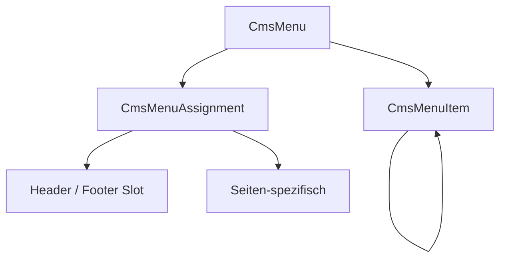

# Menü-System

Das Menü-System verwaltet Navigationsmenüs mit hierarchischen Einträgen und Slot-basierter Zuweisung. Menüs können dem Header oder Footer zugeordnet und pro Seite oder global konfiguriert werden.

---

## Architektur



**Beteiligte Dateien:**

- `src/Domain/CmsMenu.php`
- `src/Domain/CmsMenuItem.php`
- `src/Domain/CmsMenuAssignment.php`
- `src/Service/CmsMenuDefinitionService.php`
- `src/Service/CmsPageMenuService.php`
- `src/Controller/Admin/MarketingMenuDefinitionController.php`
- `src/Controller/Admin/MarketingMenuItemController.php`
- `src/Controller/Admin/MarketingMenuAssignmentController.php`
- `src/Controller/Api/V1/NamespaceMenuController.php`
- `src/Service/Mcp/MenuTools.php`

---

## Menü-Definition (CmsMenu)

Ein Menü ist ein benannter Container für Menüeinträge.

| Feld | Typ | Beschreibung |
|---|---|---|
| `id` | int | Auto-Increment ID |
| `namespace` | string | Zugehöriger Namespace |
| `label` | string | Anzeigename |
| `locale` | string | Sprachcode |
| `isActive` | bool | Aktiv-Status |
| `updatedAt` | datetime | Letzte Änderung |

---

## Menü-Items (CmsMenuItem)

Items bilden eine Baumstruktur über `parentId`. Jedes Item hat:

| Feld | Typ | Beschreibung |
|---|---|---|
| `id` | int | Auto-Increment ID |
| `menuId` | int | Zugehöriges Menü |
| `label` | string | Anzeigename |
| `href` | string | Ziel-URL oder Pfad |
| `icon` | string | Icon-Bezeichner |
| `parentId` | int/null | Eltern-Item (null = Root) |
| `position` | int | Sortierposition |
| `locale` | string | Sprachcode |
| `layout` | string | Layout-Variante (`default`) |
| `detailTitle` | string | Mega-Menü: Titel |
| `detailText` | string | Mega-Menü: Text |
| `detailSubline` | string | Mega-Menü: Unterzeile |
| `isExternal` | bool | Externer Link |
| `isActive` | bool | Aktiv-Status |
| `isStartpage` | bool | Als Startseite markiert |

### Baumstruktur

Items werden als verschachtelter Baum zurückgegeben. Kinder-Items werden über `parentId` zugeordnet und nach `position` sortiert:

```json
[
  {
    "id": 1,
    "label": "Startseite",
    "href": "/",
    "children": [
      { "id": 2, "label": "Unterseite", "href": "/unterseite", "children": [] }
    ]
  }
]
```

---

## Menü-Assignments (CmsMenuAssignment)

Assignments weisen ein Menü einem Slot zu. Slots bestimmen, wo das Menü auf der Seite erscheint:

| Slot | Beschreibung |
|---|---|
| `main` | Header-Navigation |
| `footer_1` | Footer-Spalte 1 |
| `footer_2` | Footer-Spalte 2 |
| `footer_3` | Footer-Spalte 3 |

| Feld | Typ | Beschreibung |
|---|---|---|
| `id` | int | Auto-Increment ID |
| `namespace` | string | Zugehöriger Namespace |
| `menuId` | int | Zugewiesenes Menü |
| `pageId` | int/null | Seiten-spezifisch (null = global) |
| `slot` | string | Ziel-Slot |
| `locale` | string | Sprachcode |
| `isActive` | bool | Aktiv-Status |

Assignments können **global** (für alle Seiten) oder **seiten-spezifisch** (nur für eine bestimmte Seite) sein.

---

## API-Endpoints

| Method | Pfad | Scope | Beschreibung |
|---|---|---|---|
| `GET` | `/api/v1/namespaces/{ns}/menus` | `menu:read` | Menüs auflisten |
| `POST` | `/api/v1/namespaces/{ns}/menus` | `menu:write` | Menü erstellen |
| `PATCH` | `/api/v1/namespaces/{ns}/menus/{id}` | `menu:write` | Menü aktualisieren |
| `DELETE` | `/api/v1/namespaces/{ns}/menus/{id}` | `menu:write` | Menü löschen |
| `GET` | `/api/v1/namespaces/{ns}/menus/{id}/items` | `menu:read` | Items auflisten |
| `POST` | `/api/v1/namespaces/{ns}/menus/{id}/items` | `menu:write` | Item erstellen |
| `PATCH` | `/api/v1/namespaces/{ns}/menus/{id}/items/{itemId}` | `menu:write` | Item aktualisieren |
| `DELETE` | `/api/v1/namespaces/{ns}/menus/{id}/items/{itemId}` | `menu:write` | Item löschen |

---

## Admin-Oberfläche

| Bereich | Route |
|---|---|
| Navigation-Übersicht | `/admin/navigation` |
| Menü-Verwaltung | `/admin/navigation/menus` |
| Footer-Übersicht | `/admin/navigation/footer` |
| Header-Einstellungen | `/admin/navigation` (Header-Tab) |

### Import/Export

Menüs können über den Admin-Controller exportiert und importiert werden:

- **Export:** `GET /admin/navigation/menus/export`
- **Import:** `POST /admin/navigation/menus/import`

---

## MCP-Integration

Alle 12 Menü-Tools sind über MCP verfügbar (siehe [MCP-Tool-Referenz](mcp-reference.md#menutools)). Feature-Flag `FEATURE_MARKETING_NAV_TREE_ENABLED` muss aktiv sein.
