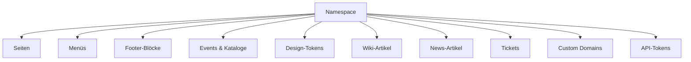
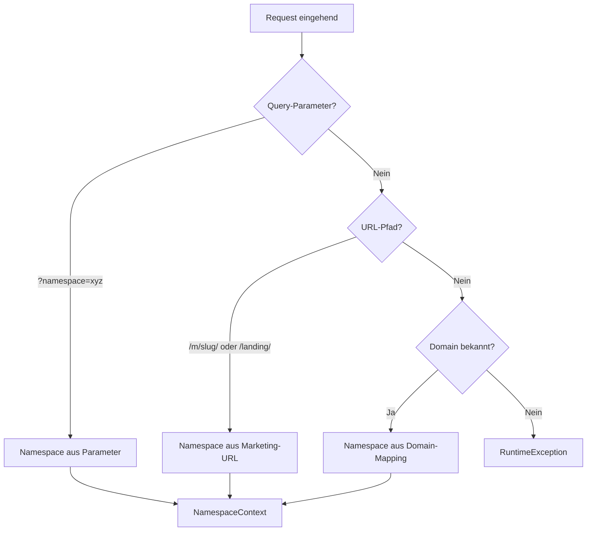

# Namespace-Management

Namespaces sind die zentrale Multi-Tenant-Einheit in edocs.cloud. Jeder Namespace isoliert Inhalte, Design, Events und Konfiguration für einen Mandanten.

---

## Übersicht

**Beteiligte Dateien:**

- `src/Service/NamespaceService.php`
- `src/Repository/NamespaceRepository.php`
- `src/Service/NamespaceValidator.php`
- `src/Service/NamespaceResolver.php`
- `src/Service/NamespaceContext.php`
- `src/Service/NamespaceAccessService.php`
- `src/Service/NamespaceBackupService.php`
- `src/Controller/Admin/NamespaceController.php`
- `src/Controller/Admin/NamespaceApiTokenController.php`

---

## Namespace-Regeln

| Regel | Wert |
|---|---|
| Pattern | `^[a-z0-9][a-z0-9-]*$` |
| Max. Länge | 100 Zeichen |
| Validierung | `NamespaceValidator` (`src/Service/NamespaceValidator.php`) |

---

## CRUD-Operationen

### Admin-Oberfläche

| Aktion | Route |
|---|---|
| Liste | `GET /admin/namespaces` |
| Daten (JSON) | `GET /admin/namespaces/data` |
| Erstellen | `POST /admin/namespaces` |
| Aktualisieren | `PUT /admin/namespaces/{id}` |
| Löschen | `DELETE /admin/namespaces/{id}` |

### MCP

Der `list_namespaces`-Aufruf ist direkt in der `McpToolRegistry` implementiert und listet alle aktiven Namespaces auf.

---

## Namespace-Auflösung

Jeder HTTP-Request durchläuft die Middleware-Kette zur Namespace-Auflösung:

### Priorität

1. **Expliziter Parameter** – `legalPageNamespace`, `pageNamespace`, `namespace` Attribut
2. **Domain-basiert** – `domainNamespace` oder `DomainService`-Lookup
3. **Fehler** – Kein Namespace gefunden → RuntimeException

Das Ergebnis ist ein `NamespaceContext`-Value-Object mit:

- `namespace` – Aufgelöster Namespace
- `candidates` – Alle Kandidaten
- `host` – Normalisierter Hostname
- `usedFallback` – Fallback-Namespace verwendet

---

## Benutzer-Zuordnung

Benutzer werden über die `user_namespaces`-Tabelle Namespaces zugewiesen:

| Feld | Beschreibung |
|---|---|
| `user_id` | Benutzer-ID |
| `namespace` | Namespace-Slug |
| `is_default` | Standard-Namespace des Benutzers |

Der `NamespaceAccessService` prüft in der `RoleAuthMiddleware`, ob ein Benutzer Zugriff auf den angeforderten Namespace hat. Administratoren haben automatisch Zugriff auf alle Namespaces.

---

## API-Tokens

Jeder Namespace kann eigene API-Tokens für die REST-API erstellen:

| Aktion | Route |
|---|---|
| Token-Übersicht | `GET /admin/namespaces` (API-Tokens Tab) |
| Token-Liste (JSON) | `GET /admin/namespaces/api-tokens` |
| Token erstellen | `POST /admin/namespaces/api-tokens` |
| Token widerrufen | `PUT /admin/namespaces/api-tokens/{id}/revoke` |
| Token löschen | `DELETE /admin/namespaces/api-tokens/{id}` |

Tokens sind an **Scopes** gebunden: `cms:read`, `cms:write`, `seo:write`, `menu:read`, `menu:write`, `news:read`, `news:write`.

---

## Export/Import

Der `NamespaceBackupService` ermöglicht den vollständigen Export und Import eines Namespace:

### Export

Enthält alle Namespace-Daten als JSON:

- Seiten (inkl. Blocks, SEO-Config)
- Menüs und Items
- Footer-Blöcke
- Events und Kataloge
- Teams und Ergebnisse
- Design-Tokens
- Wiki-Artikel
- Projekt-Einstellungen

### Import

!!! warning "Destruktive Operation"
    Der Import löscht alle bestehenden Daten des Namespace vor der Wiederherstellung.

Zugriff über:

- **Admin:** `/admin/backups`
- **MCP:** `export_namespace` / `import_namespace`

---

## Seitenbaum

Seiten innerhalb eines Namespace bilden eine Baumstruktur über `parentId`. Der Baum kann über folgende Wege abgerufen werden:

| Zugang | Pfad |
|---|---|
| Admin-UI | `/admin/projects/tree` |
| API v1 | `GET /api/v1/namespaces/{ns}/pages/tree` |
| MCP | `get_page_tree` |
