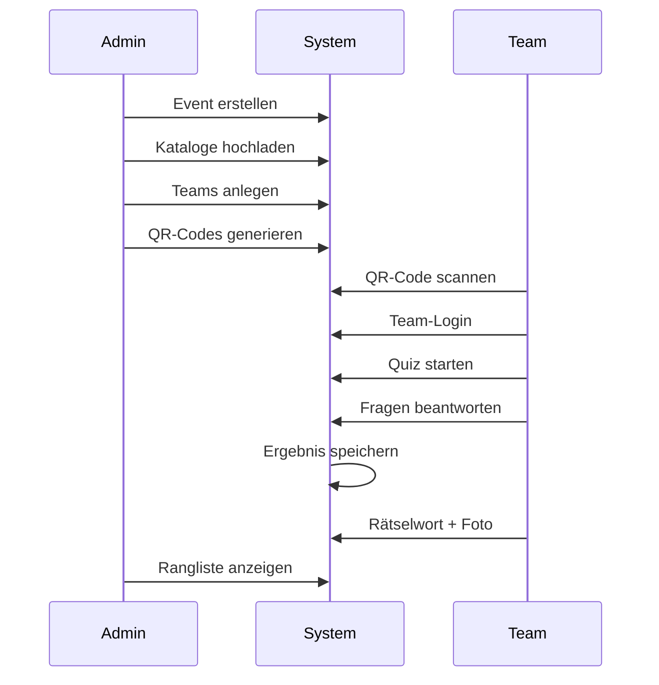

# Quiz & Events

Das Quiz-Modul ist der Kern der Anwendung. Es ermöglicht die Durchführung von Quiz-Rallyes auf Firmenveranstaltungen mit Teams, Fragenkatalogen und Echtzeit-Ergebnissen.

---

## Ablauf

---

## Events

Ein Event ist eine zeitlich begrenzte Veranstaltung, die einen oder mehrere Fragenkataloge beinhaltet.

### Felder

| Feld | Typ | Beschreibung |
|---|---|---|
| `uid` | string | Eindeutige Event-ID |
| `namespace` | string | Zugehöriger Namespace |
| `name` | string | Eventname |
| `slug` | string | URL-Slug |
| `start_date` | datetime | Beginn |
| `end_date` | datetime | Ende |
| `description` | text | Beschreibung |
| `published` | bool | Veröffentlicht |

### Event-Konfiguration

Die `config`-Tabelle speichert Event-spezifische Einstellungen:

- Farben, Logo, OG-Image
- QR-Code-Design (Farbe, Größe, Logo)
- Shuffle-Optionen für Fragen
- Sticker-Einstellungen
- Team-Namensstrategie (`ai` oder `lexicon`)
- Random-Name-Buffer und -Locale
- Effekt-Profile

---

## Fragenkataloge

Kataloge enthalten die Fragen eines Events. Sie können per JSON importiert oder über die Admin-Oberfläche erstellt werden.

### Fragetypen

| Typ | Beschreibung |
|---|---|
| Sortieren | Elemente in die richtige Reihenfolge bringen |
| Zuordnen | Elemente korrekt zuordnen |
| Multiple Choice | Eine oder mehrere richtige Antworten |
| Swipe-Karten | Wisch-Geste für richtig/falsch |
| Foto mit Texteingabe | Bild anzeigen, Text eingeben |
| "Hätten Sie es gewusst?" | Informationskarte mit Auflösung |

### Scoring

Fragen können individuelle Punktwerte haben:

- `points` – Punkte pro Frage
- `countdown` – Zeitlimit in Sekunden
- Scoring-Metriken werden pro Frage-Ergebnis erfasst (`question_results`)

---

## Teams

Teams werden pro Event verwaltet und können:

- Manuell im Admin-Bereich angelegt werden
- Über QR-Codes zugewiesen werden
- KI-generierte Teamnamen erhalten (über RAG-Service)

### KI-Teamnamen

| Einstellung | Beschreibung |
|---|---|
| `randomNameStrategy` | `ai` (Standard) oder `lexicon` |
| `randomNameBuffer` | Vorreservierte Vorschläge (0–99.999) |
| `randomNameLocale` | Sprache der Vorschläge |

Der `TeamNameService` nutzt den konfigurierten RAG-Chat-Service für KI-Vorschläge. Admins können über `/api/team-names/preview` eine Vorschau abrufen.

---

## Ergebnisse

Ergebnisse werden nach Abschluss eines Katalogs gespeichert:

| Feld | Beschreibung |
|---|---|
| `name` | Teamname |
| `catalog` | Katalog-Slug |
| `correct` | Richtige Antworten |
| `total` | Gesamtfragen |
| `wrong` | Falsche Antworten |
| `answers` | Detail-Array pro Frage |

### Export

- **PDF** – Ergebnis-Übersicht als PDF
- **CSV** – Rohdaten-Export
- **JSON** – API-Export

---

## API-Endpoints

| Method | Pfad | Beschreibung |
|---|---|---|
| `GET` | `/api/v1/namespaces/{ns}/events` | Events auflisten |
| `GET` | `/api/v1/namespaces/{ns}/events/{uid}` | Event abrufen |
| `POST` | `/api/v1/namespaces/{ns}/events` | Event erstellen |
| `PATCH` | `/api/v1/namespaces/{ns}/events/{uid}` | Event aktualisieren |
| `GET` | `/api/v1/namespaces/{ns}/events/{uid}/catalogs` | Kataloge auflisten |
| `GET` | `/api/v1/namespaces/{ns}/events/{uid}/catalogs/{slug}` | Katalog abrufen |
| `PUT` | `/api/v1/namespaces/{ns}/events/{uid}/catalogs/{slug}` | Katalog erstellen/aktualisieren |
| `GET` | `/api/v1/namespaces/{ns}/events/{uid}/results` | Ergebnisse auflisten |
| `POST` | `/api/v1/namespaces/{ns}/events/{uid}/results` | Ergebnis einreichen |
| `DELETE` | `/api/v1/namespaces/{ns}/events/{uid}/results` | Ergebnisse löschen |
| `GET` | `/api/v1/namespaces/{ns}/events/{uid}/teams` | Teams auflisten |
| `PUT` | `/api/v1/namespaces/{ns}/events/{uid}/teams` | Teams ersetzen |

---

## Admin-Oberfläche

| Bereich | Route |
|---|---|
| Event-Liste | `/admin/events` |
| Event-Einstellungen | `/admin/event/settings` |
| Event-Dashboard | `/admin/event/dashboard` |
| Kataloge | `/admin/catalogs` |
| Ergebnisse | `/results-hub` |
| Teams | `/admin` (Teams-Tab) |
| QR-Codes | Generierung über `QrController` |
