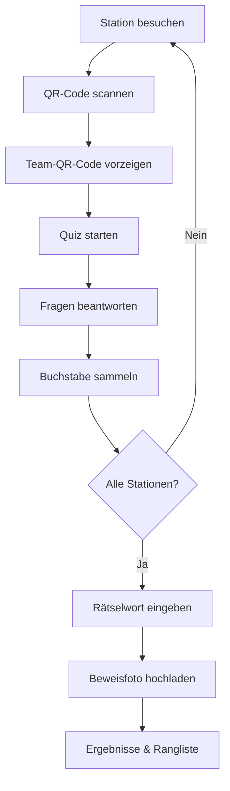

# Spielablauf

Das Quiz-Modul von edocs.cloud ermöglicht interaktive Quiz-Rallyes auf Veranstaltungen. Teams lösen Aufgaben an verschiedenen Stationen und sammeln Punkte.

---

## Ablauf einer Quiz-Rallye

## Schritt für Schritt

1. **QR-Code scannen** – An jeder Station ist ein QR-Code angebracht. Nach dem Öffnen des Links scannt ihr euren Team-QR-Code. Nur bekannte Teams werden zugelassen.

2. **Quiz starten** – Nach dem Login startet automatisch der passende Fragenkatalog für die Station. Ein einmal gelöster Katalog kann während der Rallye nicht noch einmal gestartet werden.

3. **Fragen beantworten** – Jede Frage hat einen „Weiter"-Button. Die Antwort wird direkt überprüft. Ob sie richtig war, erfahrt ihr am Ende des Katalogs.

4. **Buchstabe sammeln** – Nach jeder Runde erscheint ein Buchstabe, der Teil des Rätselworts ist. Schritt für Schritt ergibt sich die Lösung.

5. **Rätseln & Foto hochladen** – Wer das Rätselwort errät, kann es direkt eingeben. Dazu kann ein Beweisfoto hochgeladen werden (DSGVO-konform mit Einwilligung).

6. **Ergebnisse & Rangliste** – Nach Abschluss aller Stationen erscheint ein Link zur Ergebnisübersicht. Im Adminbereich gibt es eine Rangliste mit den besten Platzierungen.

---

## Fragetypen

| Typ | Beschreibung |
|---|---|
| Sortieren | Elemente in die richtige Reihenfolge bringen |
| Zuordnen | Elemente korrekt per Drag & Drop zuordnen |
| Multiple Choice | Eine oder mehrere richtige Antworten auswählen |
| Swipe-Karten | Wisch-Geste für richtig/falsch |
| Foto mit Texteingabe | Bild anschauen und Antwort eintippen |
| „Hätten Sie es gewusst?" | Informationskarte mit Auflösung |

---

## Scoring

Jede Frage kann individuelle Punktwerte und ein optionales Zeitlimit (Countdown) haben. Die Gesamtpunktzahl ergibt sich aus der Anzahl korrekt gelöster Aufgaben.

---

## Team-Management

Teams werden im Admin-Bereich angelegt. Optionen:

- **Manuelle Erstellung** – Name direkt eingeben
- **KI-generierte Namen** – Über den RAG-Service automatisch generierte Vorschläge
- **QR-Code-Login** – Jedes Team erhält einen eigenen QR-Code für die Anmeldung

Admins können Teamnamen vorab über `/api/team-names/preview` prüfen.

---

## Für Admins

| Aufgabe | Wo |
|---|---|
| Events verwalten | `/admin/events` |
| Kataloge erstellen | `/admin/catalogs` |
| Teams anlegen | Admin-Dashboard (Teams-Tab) |
| QR-Codes generieren | Über `QrController` |
| Ergebnisse einsehen | `/results-hub` |
| Ergebnisse exportieren | PDF/CSV-Download im Admin |
