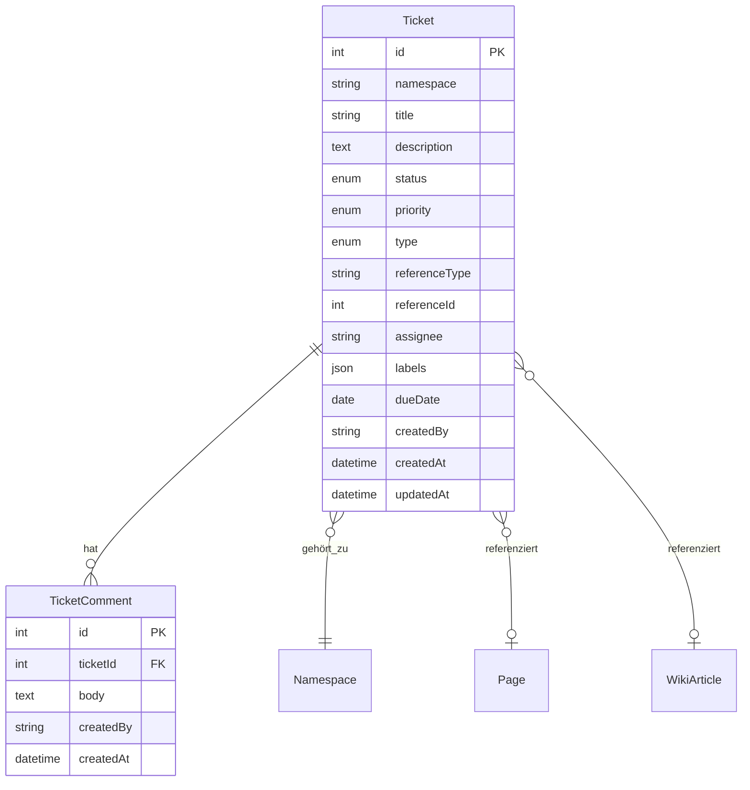
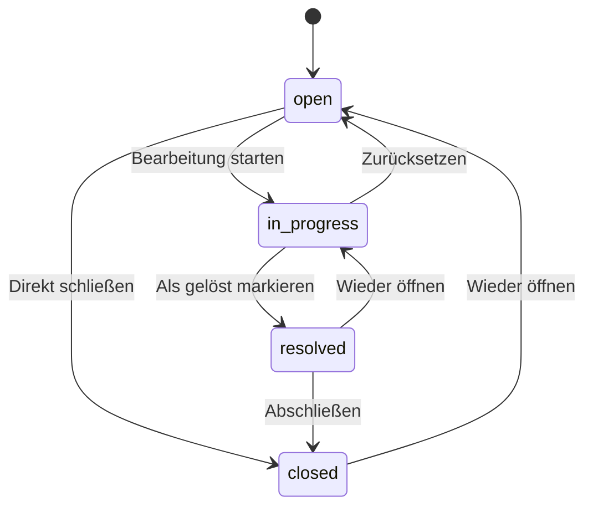

# Ticketsystem

Das Ticketsystem ermöglicht die Aufgaben- und Bug-Verwaltung innerhalb eines Namespace. Tickets können an Wiki-Artikel oder CMS-Seiten referenziert werden und durchlaufen einen definierten Status-Workflow.

---

## Datenmodell

**Beteiligte Dateien:**

- `src/Domain/Ticket.php`
- `src/Domain/TicketComment.php`
- `src/Service/TicketService.php`
- `src/Controller/Api/V1/NamespaceTicketController.php`
- `src/Service/Mcp/TicketTools.php`

---

## Felder

### Ticket

| Feld | Typ | Werte | Beschreibung |
|---|---|---|---|
| `status` | enum | `open`, `in_progress`, `resolved`, `closed` | Aktueller Status |
| `priority` | enum | `low`, `normal`, `high`, `critical` | Priorität |
| `type` | enum | `bug`, `task`, `review`, `improvement` | Ticket-Typ |
| `referenceType` | string | `wiki_article`, `page` | Verknüpfter Objekttyp |
| `referenceId` | int | – | ID des verknüpften Objekts |
| `assignee` | string | – | Zugewiesene Person |
| `labels` | JSON-Array | – | Freie Labels/Tags |
| `dueDate` | date | ISO 8601 | Fälligkeitsdatum |

---

## Status-Transitions

Nicht erlaubte Übergänge werden vom `TicketService` mit einer Fehlermeldung abgelehnt.

---

## API-Endpoints

Alle Ticket-Endpoints liegen unter `/api/v1/namespaces/{ns}/tickets`.

| Method | Pfad | Beschreibung |
|---|---|---|
| `GET` | `/tickets` | Tickets auflisten (mit Filtern) |
| `GET` | `/tickets/{id}` | Einzelnes Ticket |
| `POST` | `/tickets` | Ticket erstellen |
| `PATCH` | `/tickets/{id}` | Ticket aktualisieren |
| `POST` | `/tickets/{id}/transition` | Status ändern |
| `DELETE` | `/tickets/{id}` | Ticket löschen |
| `GET` | `/tickets/{id}/comments` | Kommentare auflisten |
| `POST` | `/tickets/{id}/comments` | Kommentar hinzufügen |
| `DELETE` | `/tickets/{id}/comments/{commentId}` | Kommentar löschen |

### Filter (Query-Parameter für `GET /tickets`)

| Parameter | Beschreibung |
|---|---|
| `status` | Nach Status filtern |
| `priority` | Nach Priorität filtern |
| `type` | Nach Typ filtern |
| `assignee` | Nach zugewiesener Person |
| `referenceType` | Nach Referenztyp |
| `referenceId` | Nach Referenz-ID |

---

## MCP-Integration

Alle Ticket-Operationen sind über MCP-Tools verfügbar (siehe [MCP-Tool-Referenz](mcp-reference.md#tickettools)).

---

## Kommentare

Kommentare sind einfache Text-Einträge, die einem Ticket zugeordnet werden. Sie enthalten:

- `body` – Kommentartext
- `createdBy` – Autor
- `createdAt` – Zeitstempel

Kommentare können nur hinzugefügt und gelöscht, nicht bearbeitet werden.
