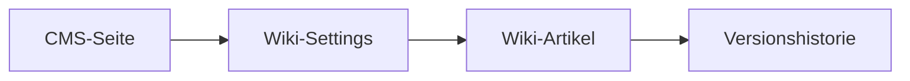
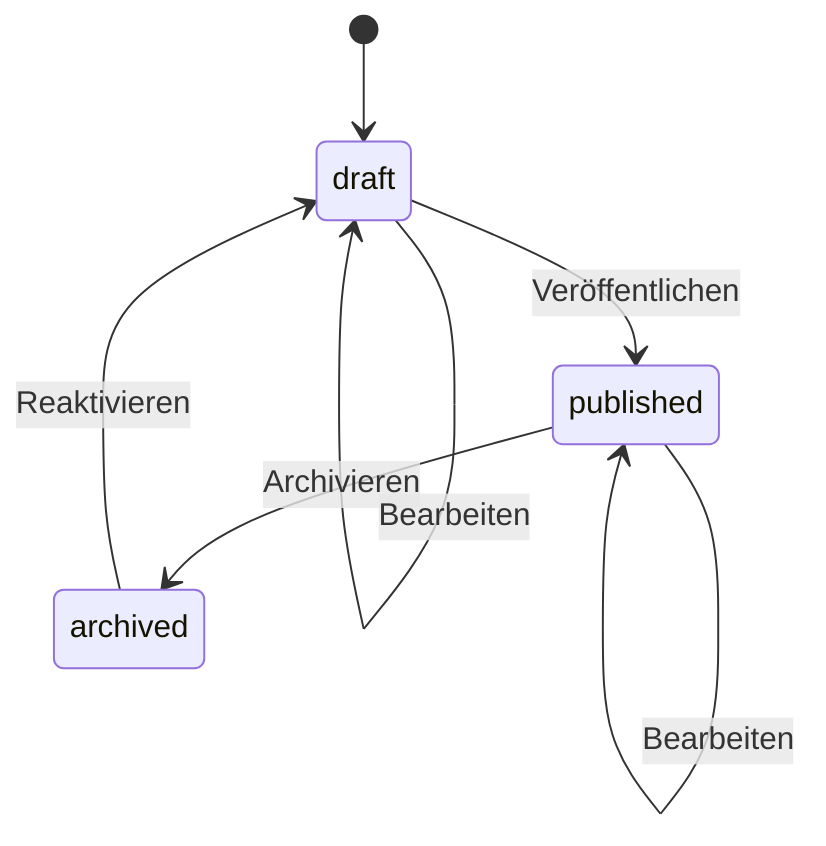

# Wiki-Modul

Das Wiki-Modul erweitert CMS-Seiten um eine integrierte Wissensdatenbank. Jede Page kann ein eigenes Wiki aktivieren, das Artikel in Markdown verwaltet, versioniert und per Status-Workflow steuert.

---

## Architektur



| Komponente | Beschreibung |
|---|---|
| `CmsPageWikiSettings` | Aktivierung und Konfiguration pro Seite |
| `CmsPageWikiArticle` | Einzelner Artikel mit Markdown-Inhalt |
| `CmsPageWikiVersion` | Automatische Versionierung bei jeder Änderung |

**Beteiligte Dateien:**

- `src/Service/CmsPageWikiArticleService.php`
- `src/Service/CmsPageWikiSettingsService.php`
- `src/Domain/CmsPageWikiArticle.php`
- `src/Domain/CmsPageWikiSettings.php`
- `src/Domain/CmsPageWikiVersion.php`
- `src/Controller/Admin/CmsPageWikiController.php`
- `src/Controller/Marketing/CmsPageWikiArticleController.php`
- `src/Controller/Marketing/CmsPageWikiListController.php`
- `src/Service/Mcp/WikiTools.php`

---

## Wiki aktivieren

Ein Wiki wird pro Seite über die Wiki-Settings aktiviert:

```json
{
  "pageId": 42,
  "isActive": true,
  "menuLabel": "Dokumentation",
  "menuLabels": { "de": "Dokumentation", "en": "Documentation" }
}
```

Feature-Flag: Die globale Umgebungsvariable `FEATURE_WIKI_ENABLED=true` muss gesetzt sein.

---

## Artikel-CRUD

### Felder

| Feld | Typ | Beschreibung |
|---|---|---|
| `id` | int | Auto-Increment ID |
| `pageId` | int | Zugehörige CMS-Seite |
| `locale` | string | Sprachcode (z.B. `de`, `en`) |
| `slug` | string | URL-Slug (eindeutig pro Page+Locale) |
| `title` | string | Artikeltitel |
| `markdown` | text | Inhalt in Markdown |
| `excerpt` | string | Kurzfassung |
| `status` | enum | `draft`, `published`, `archived` |
| `isStartDocument` | bool | Als Einstiegsseite markiert |
| `createdAt` | datetime | Erstellungszeitpunkt |
| `updatedAt` | datetime | Letzte Änderung |

### Operationen

| Aktion | Admin-Route | MCP-Tool |
|---|---|---|
| Auflisten | `GET /admin/pages/{slug}/wiki` | `list_wiki_articles` |
| Erstellen | `POST /admin/pages/wiki/article` | `create_wiki_article` |
| Bearbeiten | `PUT /admin/pages/wiki/article/{id}` | `update_wiki_article` |
| Löschen | `DELETE /admin/pages/wiki/article/{id}` | (via Admin-Controller) |
| Duplizieren | `POST /admin/pages/wiki/article/{id}/duplicate` | – |
| Sortieren | `POST /admin/pages/wiki/article/sort` | – |
| Anzeigen | `GET /m/{slug}/wiki/{articleSlug}` | `get_wiki_article` |

---

## Status-Workflow



- **draft** – Entwurf, nur für Autoren sichtbar
- **published** – Öffentlich sichtbar
- **archived** – Nicht mehr sichtbar, aber aufbewahrt

---

## Versionierung

Jede Änderung eines Artikels erzeugt automatisch einen neuen Eintrag in `cms_page_wiki_versions`:

| Feld | Beschreibung |
|---|---|
| `articleId` | Referenz auf den Artikel |
| `version` | Fortlaufende Versionsnummer |
| `content` | JSON-Snapshot des gesamten Artikels |
| `createdAt` | Zeitpunkt der Version |

Versionen können über `get_wiki_article_versions` (MCP) oder im Admin-UI eingesehen werden.

---

## Startdokument

Pro Seite+Locale kann genau ein Artikel als **Startdokument** markiert werden. Dieses wird automatisch angezeigt, wenn das Wiki ohne expliziten Artikel-Slug aufgerufen wird.

---

## Öffentliche Ansicht

Wiki-Artikel werden unter dem Marketing-URL-Schema bereitgestellt:

- **Liste:** `/m/{pageSlug}/wiki`
- **Artikel:** `/m/{pageSlug}/wiki/{articleSlug}`

Der `CmsPageWikiListController` rendert die Übersicht, der `CmsPageWikiArticleController` den einzelnen Artikel mit Markdown-Rendering.
